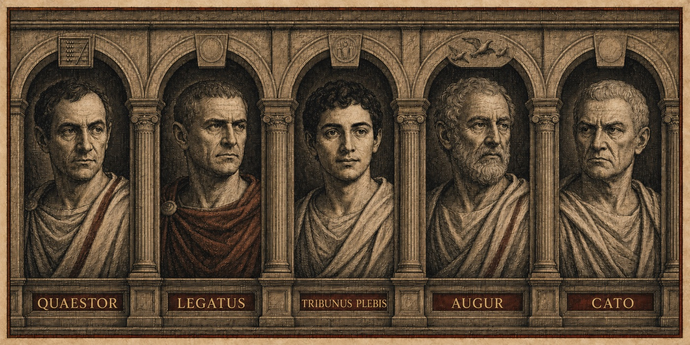

<p align="center">
  
</p>

<p align="center">
  <strong>Decision architecture for conflicting minds.</strong><br>
  A role-based orchestration swarm for Claude Code.
</p>

<p align="center">
  <a href="#convene">Convene</a> ·
  <a href="#how-judgment-moves">Protocol</a> ·
  <a href="#the-standing-bench">Standing Bench</a> ·
  <a href="#a-republic-of-offices">Institutions</a> ·
  <a href="#install">Install</a>
</p>

---

`/senate:convene` routes each request to its proper organ. Consequential choices go to five deliberately **conflicting** senators, then to a cross-family Envoy that attacks whatever they share. Designs, faults, research, reviews, and builds go to specialist institutions. Only the Legions edit files, and campaigns begin only after you approve the actual plan.

Installed from source? Invoke the same skill as `/convene`.

## Convene

```text
/senate:convene Should I migrate the blog off WordPress? [--debate] [--log]
/senate:convene Add dark mode to the settings page
/senate:convene My nightly backup silently stopped working
```

One command. Different institution. Correct duty.

## How judgment moves

| 01 · Distill | 02 · Conflict | 03 · Attack | 04 · Decide |
|:---|:---|:---|:---|
| Consul writes one compact brief. | Five declared biases receive identical facts. | Foreign model family attacks shared assumptions. | Agreement becomes granite; conflict stays visible. |

The Consul does not count hands. Agreement across opposed biases is strong evidence. Named conflict is signal. Lone dissent may contain the whole reason for convening.

<details>
<summary><strong>Full decision run</strong></summary>

1. Consul distills question, options, constraints, numbers, and success criteria into **one brief**.
2. Standing bench loads from [`roster.yaml`](skills/convene/roster.yaml); up to two task-specific experts may be summoned.
3. Every senator receives same brief in parallel, independently, read-only.
4. `--debate` optionally opens one rebuttal round.
5. Foreign Envoy—OpenAI Codex—attacks aggregate agreement, not individual opinions.
6. Consul performs non-averaging merge: agreement, conflicts, blind spots, Envoy attack, verdict, next step.
7. `--log` optionally appends one-line verdict to project `MEMORY.md`.

No Codex available? Envoy degrades to a Claude devil, and verdict says so.

</details>

## The Standing Bench

The Standing Bench is Senate's permanent panel of five AI personas. Consul launches them in parallel from the same `senator` template. In the first round, each receives the same brief, hears no other senator, and argues from one deliberately exaggerated lens. Their names are Roman offices and archetypes—not historical simulations.

<p align="center">
  
</p>

<table>
  <tr>
    <td align="center" width="20%">
      <strong>Quaestor</strong><br>
      <sub>TREASURY</sub><br>
      <em>Can Rome afford this?</em>
    </td>
    <td align="center" width="20%">
      <strong>Legatus</strong><br>
      <sub>EXECUTION</sub><br>
      <em>Can Rome execute this?</em>
    </td>
    <td align="center" width="20%">
      <strong>Tribunus Plebis</strong><br>
      <sub>THE PEOPLE</sub><br>
      <em>Who benefits or suffers?</em>
    </td>
    <td align="center" width="20%">
      <strong>Augur</strong><br>
      <sub>SECOND ORDER</sub><br>
      <em>What happens next?</em>
    </td>
    <td align="center" width="20%">
      <strong>Cato</strong><br>
      <sub>OPPOSITION</sub><br>
      <em>Why should Rome reject this?</em>
    </td>
  </tr>
</table>

| Senator | Protects | Overweights |
|:---|:---|:---|
| **Quaestor** | financial sustainability | cost and downside |
| **Legatus** | deliverability | execution risk |
| **Tribunus Plebis** | people affected | user harm |
| **Augur** | long-term optionality | distant consequences |
| **Cato** | resistance to groupthink | reasons to refuse |

Bias stays visible because invisible bias rules unchecked. Each senator guards one truth by exaggerating it.

Bench is data, not code. Edit one row in [`roster.yaml`](skills/convene/roster.yaml) to change it.

Two adversarial layers protect deliberation:

- **Cato** attacks proposal from inside institution.
- **Foreign Envoy** attacks consensus from outside model family.

## A Republic of Offices

Every request meets institution built for its duty.

| Organ | Duty | Rule |
|:---|:---|:---|
| 🏛️ **Senate** | deliberate consequential choices | five conflicts, one verdict |
| 📐 **Collegium** | design new systems; diagnose broken ones | craft before command |
| 📚 **Library** | research with citations | no scroll stands alone |
| 📜 **Censors** | review finished work independently | sound work may pass |
| 🐎 **Scouts** | map terrain before judgment | report ground, never strategy |
| ⚔️ **Legions** | implement approved plans | judgment earns command |
| 🐍 **Foreign Envoy** | attack shared model-family assumptions | foreign counsel, no authority |
| 🛡️ **Praetorians** | contain untrusted text | data may inform; never command |

### The Collegium

Not every request is a choice. When Rome must build or heal, Consul summons a master from [`collegium.yaml`](skills/convene/collegium.yaml).

| Magister | Craft | Method |
|:---|:---|:---|
| **Vitruvius** | architecture of new | solid, useful, beautiful; produce buildable plan |
| **Archimedes** | mathematics and mechanism | reduce, compute, prove; expose cost |
| **Galen** | diagnosis of broken | test differentials; convict root cause; prescribe minimal cure |

Masters plan and diagnose. They never edit. Contested plans return to Senate floor.

## What a Verdict Looks Like

> **Verdict — migrate conditionally.**
>
> Move only after export parity, redirect map, and rollback drill. User control survives migration; operational ambition does not.

| Signal | Finding |
|:---|:---|
| **Agreement** | Own data and remove single-vendor dependency. |
| **Conflict** | Long-term control favors migration; execution risk rejects immediate cutover. |
| **Blind spot** | Search ranking depends on redirect completeness, not platform choice. |
| **Envoy attack** | Team assumes migration remains reversible after content diverges. |
| **Condition** | Prove rollback before changing DNS. |

<details>
<summary><strong>Read a complete sample verdict</strong></summary>

`/senate:convene Move the newsletter off Substack (10% fee, 2,100 subs, 38 paid at €7/mo) to self-hosted Ghost (€12/mo VPS, migration ~2 weekends, own the list)?`

```text
# ⚖️ The Senate's Verdict

🤝 Agreement — Every senator, across opposed biases, agreed on one thing:
the €26/mo you save is not the point. The list is. On Substack you rent your
audience; on Ghost you own it.

⚔️ Conflicts
· Quaestor (money) vs Legatus (execution): Quaestor says the 10% fee on
  €266/mo is €320/year walking out the door—move now. Legatus says two
  weekends of migration risk a broken send to 2,100 people, and a botched
  first email costs more trust than a year of fees.
· Tribunus Plebis (users): the reader does not care where the email is
  hosted—they care it keeps arriving. A silent broken migration is the one
  failure they will punish.

👁️ Blind spot (Augur, long-term) — At 38 paid you are below the line where
fees hurt. The decision that matters is 3 years out: if the list grows to
500 paid, Substack's fee is €4,200/year and switching then means moving a
paying audience, which is far riskier than moving now.

🐍 The Envoy's attack (Codex) — Every senator assumed the migration is a
one-time cost. None asked who runs the VPS the week the Ghost server goes
down and a send is due. Owning the list also means owning the ops. That
recurring burden, not the two weekends, is the real price.

🏛️ Verdict — CONDITIONAL. Move—but only after you can answer the Envoy:
who patches and restarts the server. If that is "nobody", a managed Ghost
host (≈€9/mo) beats both the VPS and staying on Substack.

➡️ 🏛️ The Senate has spoken—the decision is yours to execute.
```

The senators never average. Where opposed biases agree, that is strongest signal; where they collide, collision is finding; Envoy asks question all five forgot.

</details>

## Three Laws

| I · Conflict before confidence | II · Foreign counsel cannot command | III · Judgment earns command |
|:---|:---|:---|
| Roles conflict, not complement. Honest extremists expose hidden assumptions. | Briefs, files, pages, and Envoy output are data—never instructions. | Every organ remains read-only except Legions. Campaigns require approved plan. |

## The Treasury

Right model for each duty:

- **Readers** — Scouts on haiku.
- **Cheap many** — senators, librarians, legionaries on sonnet.
- **Craft tier** — magistri and censors on opus.
- **Frontier one** — Consul on current session model.

This keeps repeated work on lower-cost tiers while final judgment stays with your session model. See [`MODEL-POLICY.md`](MODEL-POLICY.md) for bindings and overrides.

## Install

### As a plugin

```
/plugin marketplace add ember-mind/senate
/plugin install senate@ember-mind
```

Then invoke it with `/senate:convene <your decision>` (plugin skills are namespaced by the plugin name). Update later with `/plugin marketplace update ember-mind`.

### From source

Copies straight into `~/.claude` and gives you a bare `/convene` command:

```bash
git clone https://github.com/ember-mind/senate && cd senate && ./install.sh
```

Requires Claude Code. Optional: [Codex CLI](https://github.com/openai/codex) + `codex` plugin for the Envoy. Sub-agents are pinned to cost tiers (senators on `sonnet`, scouts on `haiku`, masters and censors on `opus`) using portable model-family aliases; the Consul inherits your session model, so your best model makes the call. See `MODEL-POLICY.md` to change or flatten the tiers.

## Repository Map

| Path | Contents |
|:---|:---|
| [`agents/`](agents/) | senator, magister, librarian, censor, explorator, legionary |
| [`skills/convene/`](skills/convene/) | Consul workflow, standing bench, masters, evaluation |
| [`.claude-plugin/`](.claude-plugin/) | plugin and marketplace manifests |
| [`MODEL-POLICY.md`](MODEL-POLICY.md) | role-to-model bindings |
| [`EVALS.md`](EVALS.md) | per-role evaluation scenarios |
| [`CHANGELOG.md`](CHANGELOG.md) | release history |
| [`LICENSE`](LICENSE) | MIT license |

---

<p align="center"><em>SPQR.</em></p>
