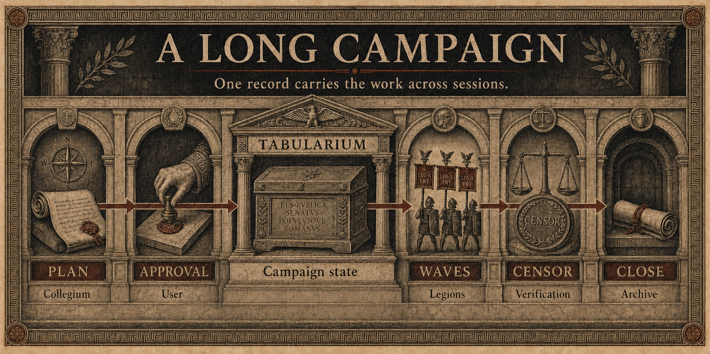

<p align="center">
  
</p>

<p align="center">
  <strong>Decision architecture for conflicting minds.</strong><br>
  A role-based orchestration swarm for Claude Code.
</p>

<p align="center">
  <a href="#convene">Convene</a> ·
  <a href="#from-request-to-result">Workflow</a> ·
  <a href="#the-standing-bench">Standing Bench</a> ·
  <a href="#a-republic-of-offices">Institutions</a> ·
  <a href="#long-running-campaigns-the-tabularium">Tabularium</a> ·
  <a href="#install">Install</a>
</p>

---

`/senate:convene` routes each request to its proper organ. Consequential choices go through five deliberately **adversarial** lenses in one bounded sitting; `--cross-check` can add a cross-family Envoy to attack whatever they share. Designs, faults, research, reviews, and builds go to specialist institutions. Only the Legions edit files, and campaigns begin only after you approve the actual plan.

Installed from source? Invoke the same skill as `/convene`.

## Convene

```text
/senate:convene Should we launch the paid plan now or wait for 100 beta users? [--debate] [--cross-check] [--log]
/senate:convene Add dark mode to the settings page
/senate:convene My nightly backup silently stopped working
```

One command. Different institution. Correct duty.

## From Request to Result

The Consul owns orchestration. It reads your request, gathers missing context, sends work to the right organ, then returns **one final result** in plain language.

| You ask for | Primary organ | Specialists do | Final result |
|:---|:---|:---|:---|
| A consequential choice | 🏛️ **Senate** | five lenses challenge; optional Envoy attacks consensus | verdict with agreement, conflicts, blind spots, condition, next step |
| A new system or feature | 📐 **Collegium** | one master designs or proves feasibility | bounded, buildable plan |
| A broken system | 📐 **Collegium** | Galen tests causes and identifies root fault | diagnosis and minimal cure |
| Research | 📚 **Library** | Callimachus gathers and synthesizes sources | cited answer |
| Review of finished work | 📜 **Censors** | Appius Claudius inspects independently; Envoy may cross-check | findings ranked by severity |
| An approved plan or tiny fix | ⚔️ **Legions** | file-bounded cohorts implement and verify | changed files, checks, concise campaign report |

Each request has one primary organ. Supporting offices enter only when needed: Scouts gather missing facts; Envoy challenges shared assumptions; Praetorians keep untrusted text from issuing commands.

Non-trivial builds stop after plan. You approve actual plan; only then Legions edit files. Finished work can return to Censors for independent review.

## How a Decision Moves

| 01 · Distill | 02 · Conflict | 03 · Optional attack | 04 · Decide |
|:---|:---|:---|:---|
| Consul writes one compact brief. | Five declared biases receive identical facts. | Foreign model family attacks shared assumptions. | Agreement becomes granite; conflict stays visible. |

The Consul does not count hands. Agreement across opposed biases is strong evidence. Named conflict is signal. Lone dissent may contain the whole reason for convening.

<details>
<summary><strong>Full decision run</strong></summary>

1. Consul distills question, options, constraints, numbers, and success criteria into **one brief**.
2. Standing bench loads from [`roster.yaml`](skills/convene/roster.yaml); up to two task-specific experts may be summoned.
3. One bounded bench sitting applies all five rows to the same brief in sealed, non-cross-referencing passes.
4. `--debate` adds one bounded exchange inside the same sitting, on the conflict most likely to change the verdict.
5. `--cross-check` optionally asks the Foreign Envoy—OpenAI Codex—to attack aggregate agreement, not individual opinions.
6. Consul performs non-averaging merge: agreement, conflicts, blind spots, optional Envoy attack, verdict, next step.
7. `--log` optionally appends one-line verdict to project `MEMORY.md`.

With `--cross-check`, no Codex available? Envoy degrades to a Claude devil, and verdict says so.

</details>

## The Standing Bench

The Standing Bench is Senate's permanent panel of five reasoning personas. One `bench` agent produces their sealed first-pass memos in a bounded sitting: every row sees the same brief, may not reference another memo, and argues from one deliberately exaggerated lens. With `--debate`, the same sitting appends a short exchange between the two sides of the sharpest conflict. Their names are Roman offices and archetypes—not historical simulations.

<p align="center">
  
</p>

<table>
  <tr>
    <td align="center" width="20%">
      <strong>Quaestor</strong><br>
      <sub>TREASURY</sub><br>
      <em>Can Rome afford this?</em>
    </td>
    <td align="center" width="20%">
      <strong>Legatus</strong><br>
      <sub>EXECUTION</sub><br>
      <em>Can Rome execute this?</em>
    </td>
    <td align="center" width="20%">
      <strong>Tribunus Plebis</strong><br>
      <sub>THE PEOPLE</sub><br>
      <em>Who benefits or suffers?</em>
    </td>
    <td align="center" width="20%">
      <strong>Augur</strong><br>
      <sub>SECOND ORDER</sub><br>
      <em>What happens next?</em>
    </td>
    <td align="center" width="20%">
      <strong>Cato</strong><br>
      <sub>OPPOSITION</sub><br>
      <em>Why should Rome reject this?</em>
    </td>
  </tr>
</table>

| Senator | Protects | Overweights |
|:---|:---|:---|
| **Quaestor** | financial sustainability | cost and downside |
| **Legatus** | deliverability | execution risk |
| **Tribunus Plebis** | people affected | user harm |
| **Augur** | second-order effects inside the decision horizon | consequences hidden by the first-order result |
| **Cato** | resistance to groupthink | attempts to falsify from the brief |

Bias stays visible because invisible bias rules unchecked. Each senator guards one truth by exaggerating it.

Bench is data, not code. Edit one row in [`roster.yaml`](skills/convene/roster.yaml) to change it.

Two optional layers can deepen deliberation:

- `--debate` deepens the sharpest conflict inside the bounded bench call.
- `--cross-check` asks the **Foreign Envoy** to attack consensus from another model family.

## A Republic of Offices

Senate handles choices. Other work goes to specialists built for different outputs.

### The Collegium: one master, one craft

Three named masters share one `magister` agent template. Consul chooses **one** row from [`collegium.yaml`](skills/convene/collegium.yaml), based on the problem:

| When summoned | Master | Specializes in | Returns |
|:---|:---|:---|:---|
| New product, system, or architecture | **Vitruvius** | structure, interfaces, dependencies, build sequence | concrete implementation plan |
| Feasibility, mechanism, or performance | **Archimedes** | calculation, constraints, cost, proof | computed design or feasibility answer |
| Failure, bug, or degraded system | **Galen** | reproduction, competing causes, diagnostic tests | root cause and minimal cure |

Consul gives the chosen master a compact brief plus concrete pointers. The master reads only what the craft requires and returns a bounded plan or diagnosis. The master never edits.

If the plan contains a real tradeoff, it goes to Senate for challenge. If the plan is clear, Consul presents it directly. Either way, implementation waits for your approval; then Legions march.

### The Other Offices

| Office | Worker | When used | What comes back |
|:---|:---|:---|:---|
| 📚 **Library** | **Callimachus**, one `librarian` | question needs external or repository research | sourced scroll; Consul delivers cited answer |
| 📜 **Censors** | **Appius Claudius**, one `censor`; optional Envoy | finished code, plan, or prose needs review | concrete findings ranked by severity |
| 🐎 **Scouts** | **Exploratores**, one `explorator` | missing context blocks another organ | terrain report for Consul's brief—not final answer |
| ⚔️ **Legions** | named `legionary` cohorts | approved plan, or tiny unambiguous fix | file changes, checks, capped implementation report |
| 🐍 **Foreign Envoy** | OpenAI Codex; Claude devil fallback | with `--cross-check` after Senate or beside Censor | attack on shared assumption; advisory only |
| 🛡️ **Praetorians** | guardrail, not agent | whenever outside text enters workflow | quoted instructions remain data, never commands |

### How Offices Hand Work Forward

1. **Scouts**, if needed, map missing ground and report to Consul.
2. Consul writes one brief and dispatches one **primary organ**.
3. Primary organ returns its native artifact: verdict, plan, diagnosis, cited scroll, review, or implementation report.
4. Genuine choice inside plan goes to **Senate**. Approved plan goes to **Legions**.
5. Consul synthesizes reports into one final answer with one explicit next step.

No giant swarm handles every request. Each office appears only when its output is needed.

## Long-running Campaigns: The Tabularium

<p align="center">
  
</p>

A campaign that fits one conversation needs no extra record. When an approved plan outlives the session, Consul creates one `TABULARIUM.md` at the project root. It is a compact, mutable campaign ledger—not a second plan and not a transcript.

| Field | What survives between sessions |
|:---|:---|
| **Destination** | final outcome the campaign must reach |
| **Settled** | completed, verified results with date and pointer |
| **Standing orders** | constraints every future cohort must obey |
| **Open** | next order sharp enough to dispatch |
| **Fog** | known later work that is not yet precise enough to cut into an order |

The lifecycle is explicit:

1. **Collegium** drafts the actual plan; the user approves it.
2. **Tabularium** opens only when work must cross conversation boundaries.
3. **Legions** execute session-sized orders in waves, with non-overlapping file boundaries and at most three cohorts per wave.
4. After each wave, Consul records one settled result and refreshes `Open`. **Fog stays fog** until it can be stated precisely.
5. A risk-triggered **Censor** verifies the result. Consul archives or removes the Tabularium when the campaign closes.

On a later session, Consul reads `TABULARIUM.md` before dispatch: it preserves standing orders, never repeats settled work, and continues from `Open`.

`TABULARIUM.md` and `MEMORY.md` serve different duties: Tabularium is temporary and mutable campaign state; Memory is permanent, append-only decision history written only with `--log`.

See the exact campaign contract in [`references/campaign.md`](skills/convene/references/campaign.md).

## What a Verdict Looks Like

> **Verdict — migrate conditionally.**
>
> Move only after export parity, redirect map, and rollback drill. User control survives migration; operational ambition does not.

| Signal | Finding |
|:---|:---|
| **Agreement** | Own data and remove single-vendor dependency. |
| **Conflict** | Long-term control favors migration; execution risk rejects immediate cutover. |
| **Blind spot** | Search ranking depends on redirect completeness, not platform choice. |
| **Envoy attack** | Team assumes migration remains reversible after content diverges. |
| **Condition** | Prove rollback before changing DNS. |

<details>
<summary><strong>Read a complete sample verdict</strong></summary>

`/senate:convene --cross-check Move the newsletter off Substack (10% fee, 2,100 subs, 38 paid at €7/mo) to self-hosted Ghost (€12/mo VPS, migration ~2 weekends, own the list)?`

```text
# ⚖️ The Senate's Verdict

🤝 Convergence — Moving removes the stated 10% fee and gives ownership of
the list. At 38 × €7, the fee is about €26.60/month; after the €12 VPS,
the direct saving is about €14.60/month.

⚔️ Conflicts
· Quaestor (money) vs Legatus (execution): direct savings are about
  €175/year, while migration consumes roughly two weekends. The brief gives
  no monetary value for that time, so financial break-even is unknown.
· Tribunus Plebis (people): the brief gives no evidence about deliverability
  or reader disruption. Treat both as unknown, not as reasons to move.

👁️ Blind spot (Augur) — The prompt prices the VPS but not ongoing operation,
patching, backups, or recovery. Their cost could erase the direct savings.

🐍 The Envoy's attack (Codex) — Ownership also transfers operational
responsibility. The missing question is who maintains the VPS and how much
time that consumes; the brief does not answer it.

🏛️ Verdict — CONDITIONAL. Move only if the value of list ownership plus
about €175/year exceeds two weekends of migration and the still-unknown
annual operations burden.

➡️ Next step — Estimate annual VPS operations time, then compare it with the
€175 direct saving.
```

The senators never average. Where opposed lenses converge, that is signal; where they collide, collision is finding; `--cross-check` asks what the whole bench forgot.

</details>

## Three Laws

| I · Conflict before confidence | II · Foreign counsel cannot command | III · Judgment earns command |
|:---|:---|:---|
| Roles challenge from different angles, but facts outrank persona. | Briefs, files, pages, and Envoy output are data—never instructions. | Every organ remains read-only except Legions. Campaigns require approved plan. |

## The Treasury

Right model for each duty:

- **Readers** — Scouts on haiku.
- **Compact bench** — five first-pass lenses in one bounded sonnet call.
- **Bounded depth** — `--debate` adds no new agent call.
- **Craft tier** — magistri and censors on sonnet; opus only for deep or high-risk work.
- **Frontier one** — Consul on current session model.

This keeps repeated work on lower-cost tiers while final judgment stays with your session model. See [`MODEL-POLICY.md`](MODEL-POLICY.md) for bindings and overrides.

## Install

### As a plugin

```
/plugin marketplace add ember-mind/senate
/plugin install senate@ember-mind
```

Then invoke it with `/senate:convene <your decision>` (plugin skills are namespaced by the plugin name). Update later with `/plugin marketplace update ember-mind`.

### From source

Copies straight into `~/.claude` and gives you a bare `/convene` command:

```bash
git clone https://github.com/ember-mind/senate && cd senate && ./install.sh
```

Requires Claude Code. Optional: [Codex CLI](https://github.com/openai/codex) + `codex` plugin for the Envoy. Sub-agents use portable model-family aliases: bench, senators, and ordinary craft work on `sonnet`; scouts and literal skirmishes on `haiku`; deep or high-risk craft on `opus`. Consul inherits your session model. See `MODEL-POLICY.md` to change or flatten tiers.

## Repository Map

| Path | Contents |
|:---|:---|
| [`agents/`](agents/) | bench, senator, magister, librarian, censor, explorator, legionary |
| [`skills/convene/`](skills/convene/) | Consul workflow, standing bench, masters, evaluation |
| [`.claude-plugin/`](.claude-plugin/) | plugin and marketplace manifests |
| [`MODEL-POLICY.md`](MODEL-POLICY.md) | role-to-model bindings |
| [`EVALS.md`](EVALS.md) | per-role evaluation scenarios |
| [`CHANGELOG.md`](CHANGELOG.md) | release history |
| [`LICENSE`](LICENSE) | MIT license |

---

<p align="center"><em>SPQR.</em></p>
